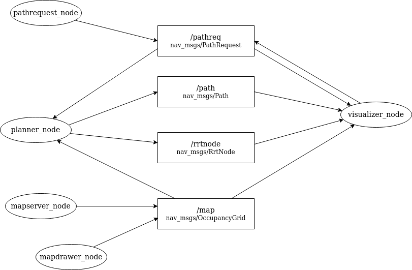

# RRT-ROS - Overview
This is an implementation of Rapidly-exploring Random Tree (RRT) algorithms in C++ for ROS Melodic. There are ROS nodes for loading and parsing a map image file (JPG/PNG/PGM), planning a path to the goal using RRT, visualizing the map and the built RRT, and an interface for drawing a custom map that can be exported as a JPG file or published directly.

## Nodes and Topics


## Table of Contents
- [RRT-ROS](#rrt-ros)
  - [Nodes and Topics](#nodes-and-topics)
- [Table of Contents](#table-of-contents)
- [Prerequisites](#prerequisites)
- [Build Guide](#build-guide)
- [How to Run](#how-to-run)
  - [Setup nodes](#setup-nodes)
  - [Start RRT algorithm](#start-rrt-algorithm)
  - [Map Drawer](#map-drawer)
- [Gallery](#gallery)
- [References](#references)

## Prerequisites
- Ubuntu 18.04 LTS
- ROS Melodic ([Required Packages](https://www.ros.org/reps/rep-0003.html#melodic-morenia-may-2018-may-2023))
  - [OpenCV 3.2.0](https://docs.opencv.org/master/d7/d9f/tutorial_linux_install.html)
    - [OpenCV Release](https://github.com/opencv/opencv/releases/tag/3.2.0)
    - [OpenCV Contrib Release](https://github.com/opencv/opencv_contrib/releases/tag/3.2.0)

## Build Guide
Clone this repository.
```cmd
> git clone https://github.com/djtfoo/rrt-ros
> cd rrt-ros
```

Use `catkin build` to build the ROS project.
```cmd
> catkin build
```
If the following error shows, run catkin build again.
<br> (insert here)

If the build is successful, you should see the following:
<br> (insert here)

## How to Run
### Setup
Launch roscore in a terminal:
```cmd
roscore
```

In each new terminal, source for the local setup file:
```cmd
> cd rrt-ros
> source devel/setup.bash
```

------------------

### Nodes

First, run `planner_node`:

```
rosrun rrt_planner planner_node
```

Optionally, run `visualizer_node` in a new terminal to show a GUI interface to configure the navigation parameters and visualize the tree building on the map:

```
rosrun rrtplanner_map visualizer_node
```

Run `mapserver_node` in a new terminal to load a map image file, generate the occupancy grid from the image, and publish it to the `/map` topic for the planner and visualizer:

```
rosrun rrtplanner_map mapserver_node <path_to_map_image> <gridsize>
```
- path_to_map_image: the file path (relative or absolute) to the map image file. The image should be PNG/JPG/PGM.
- gridsize: the size in pixels of the occupancy grid.

------------------

### Start RRT algorithm
If using `visualizer_node`, the user can select the start and goal positions using the interface, and select the RRT algorithm to use.

Otherwise, run `pathrequest_node` in an open terminal to provide the start and goal positions to start the RRT search:

```
rosrun rrt_planner pathrequest_node <start_x> <start_y> <goal_x> <goal_y> <rrt_ver>
```
- start_[xy]: the pixel coordinates of the start position.
- goal_[xy]: the pixel coordinates of the goal position.
- rrt_ver: 0 for basic RRT, 1 for RRT*.

The start and goal positions cannot be an obstacle and is checked by planner_node.

#### Output
The RRT planner begins to build the RRT, with a 5% bias towards sampling the goal state. The vertices (nodes) of the RRT are published to the `/rrtnode` topic as they are generated. If a path is found, it will be printed to the terminal and published to the `/path` topic.
<br>(show image of output)

------------------

### Visualizer
The `visualizer_node` subscribes to all of the topics and displays and updates a view of the map with the built RRT and the start and goal positions.

#### How to Use:
- Run `visualizer_node` with rosrun.
- Publish an occupancy grid map (e.g. with `mapserver_node` or `mapdrawer_node`) for `visualizer_node` to open a window displaying the map.
- Click with the left mouse button to set a start position.
- Click with the right mouse button to set a goal position.
- Click any of the "Plan Path" buttons to publish a path request using the respective RRT algorithm after setting a start and goal position.
- The visualizer will display the RRT while it gets built by the planner. If a path from the start to the goal is found, it will be highlighted in yellow.
- After the RRT planning has completed, start and goal positions can be set and a "Plan Path" request can be published again, or a new occupany grid map can be published to open a new map window.

------------------

### Map Drawer
Custom maps can be drawn using the `mapdrawer_node`. The custom map can then be exported as an image file to `"./maps/custom.jpg"`, or have its occupancy grid data published directly to the `/maps` topic.
  
When choosing to publish directly, the `planner_node` and `visualizer_node` (if wanting visualization) should already be running before publishing the data.
  
Parameters can optionally be provided to change the map size and occupancy grid size (if publishing directly). To run the map drawer:
```
rosrun rrtplanner_map mapdrawer_node <map_width> <map_height> <gridsize>
```
- map_width: the width of the map in pixels.
- map_height: the height of the map in pixels.
- gridsize: the size in pixels of the occupancy grid.

#### How to Use:
- Click and drag with the left mouse button to draw obstacles (in white).
- Click and drag with the right mouse button to erase drawn obstacles.
- Click "Publish Map" to generate the occupancy grid and publish it to the `/map` topic. This node will shutdown and exit afterwards.
- Click "Export Map" to save the drawn map to a JPG file. This node will shutdown and exit afterwards.

## Gallery
(Add GIFs of map drawer, RRT, RRT*)

## References
- [Steven M. Lavalle’s RRT web page](http://lavalle.pl/rrt/)
- [Original Lavalle et al. RRT paper](http://msl.cs.uiuc.edu/~lavalle/papers/LavKuf01.pdf)
- [Wikipedia page on RRT](https://en.wikipedia.org/wiki/Rapidly-exploring_random_tree)
- [RRT* Brief Explanation (YouTube)](https://www.youtube.com/watch?v=JM7kmWE8Gtc)
